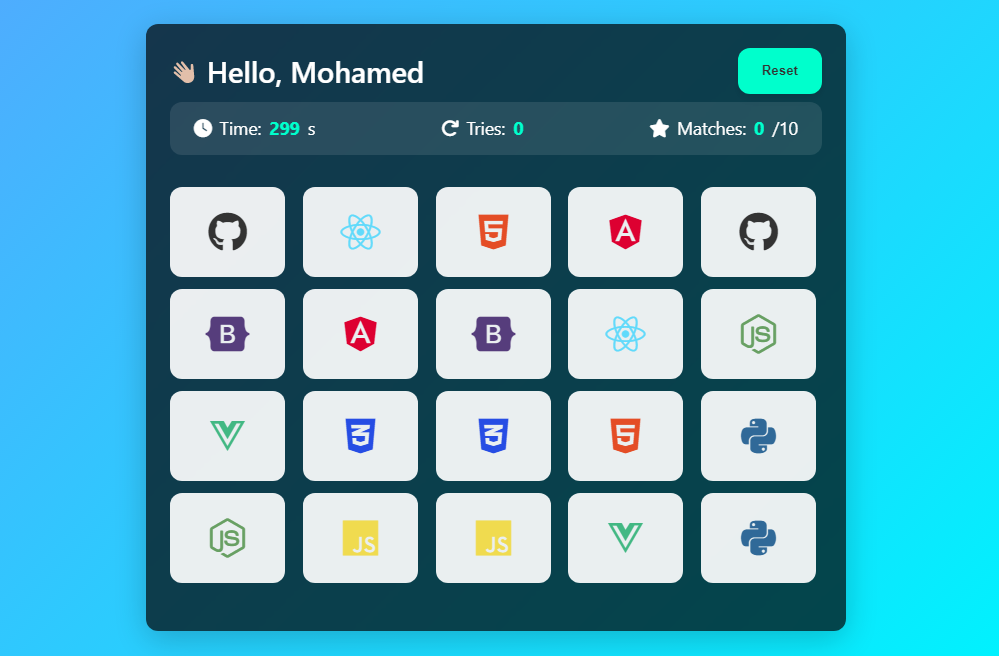
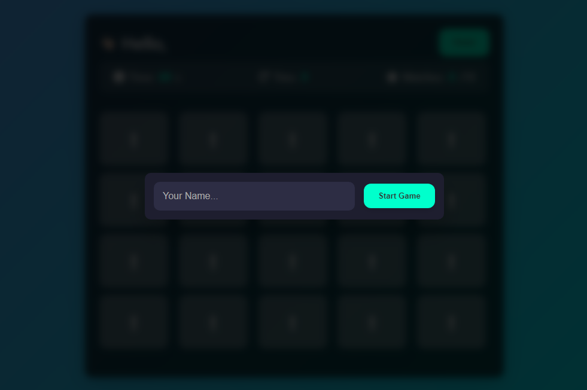

# 🧠 Memory Game

A responsive, interactive memory card game built using **HTML**, **CSS**, and **JavaScript**, themed around popular programming technologies. Flip cards, test your memory, and challenge yourself to match all tech icons!

## 🚀 Features

- 🔁 Flip cards
- 🎯 Match tech icons like HTML5, CSS3, JS
- 💎 Modern glassmorphism design using CSS variables
- 🎨 Light/dark background with vibrant accent colors
- 📱 Fully responsive layout for mobile and desktop
- 🧠 Tracks your moves and matched pairs
- 🎮 Enter player name before starting the game
- 🏁 End screen on game completion

## 🛠️ Tech Stack

- **HTML5**
- **CSS3 (Custom properties, Flexbox, Grid, Media queries)**
- **Vanilla JavaScript (DOM manipulation, event handling)**

## 📸 Screenshots




## 📂 Project Structure

📁 memory-game/ ├── 📄 index.html ├── 📄 style.css ├── 📄 script.js ├── 📁 assets/ │ └── icons, sounds, and images ├── 📁 screenshots/ │ └── screenshot-light.png │ └── screenshot-mobile.png └── 📄 README.md

## 🔧 How to Run

1. **Clone the Repository**

   ```bash
   git clone https://github.com/Mohamed-Gaber53/Memory-Game


   Open index.html in your browser
   You can just double-click the file, or run a local server:
   ```

Start Playing!
Enter your name, flip the cards, and try to match all pairs.

📄 License
This project is licensed under the MIT License.

Designed and developed by Mohamed Gaber
